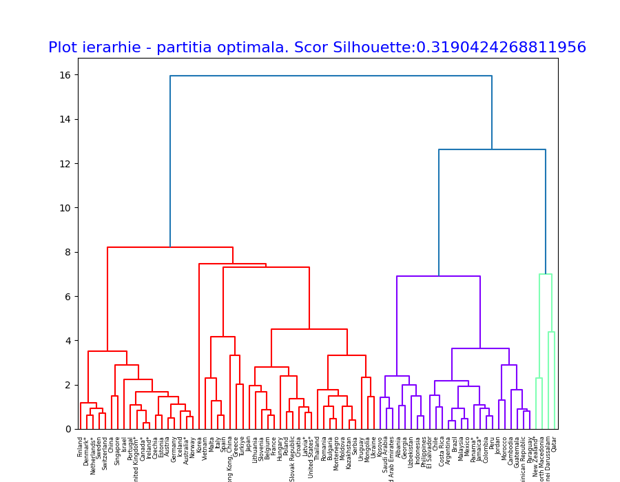
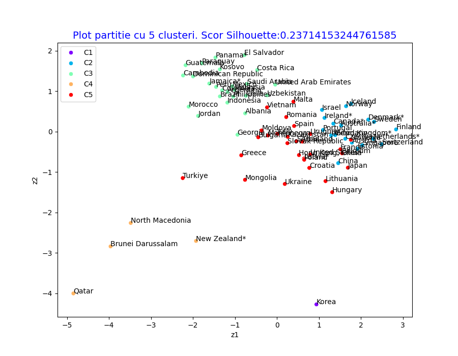
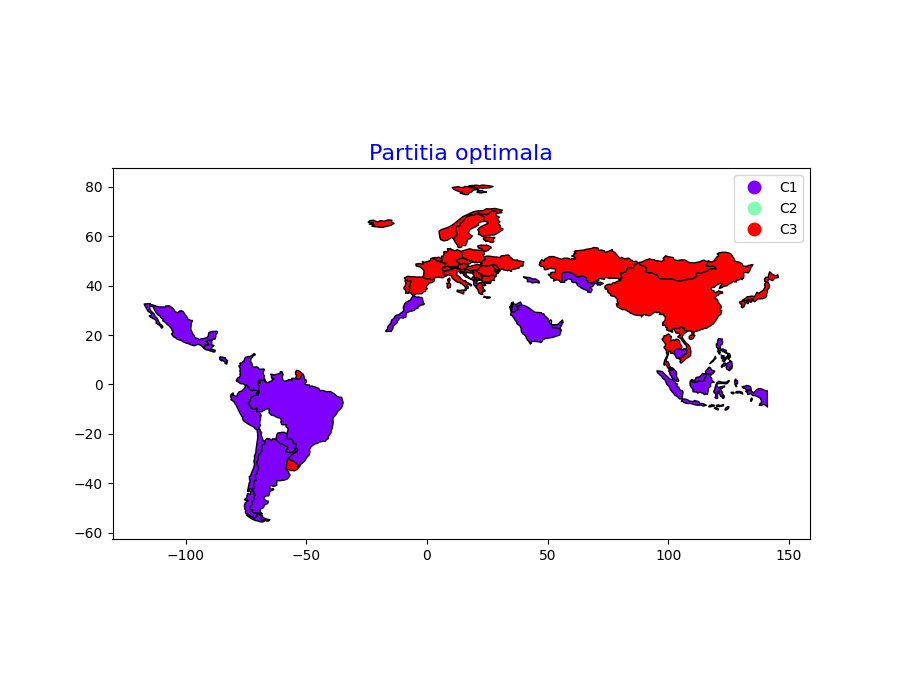

# Relația dintre performanța matematică și bunăstarea psihologică  
## Analiză de clusteri ierarhică

Acest proiect investighează relația dintre performanța la matematică și bunăstarea psihologică la nivel național, utilizând **analiza de clusteri ierarhică**.  
Studiul urmărește să identifice dacă excelența academică este asociată cu costuri psihologice ridicate (anxietate, stres, rate crescute de suicid) sau dacă există modele educaționale care susțin simultan performanța și starea de bine.

Analiza este realizată pe un set de date agregate pentru **77 de țări**, integrând indicatori educaționali, psihologici și sociali.

---

## Obiectivul studiului

Obiectivul principal este de a răspunde la întrebarea:

**„În ce măsură performanța la matematică reprezintă un predictor valid pentru o societate fericită?”**

Pentru a răspunde acestei întrebări, țările sunt grupate în clustere omogene, astfel încât să poată fi identificate tipologii distincte de sisteme educaționale și sociale.

---

## Date și variabile utilizate

Analiza se bazează pe șase variabile cheie:

- **Mathematics performance** (OECD PISA 2022)
- **Mathematics anxiety** (OECD PISA 2022)
- **Ladder score (fericire subiectivă)** (World Happiness Report)
- **Healthy life expectancy** (World Bank)
- **Freedom to make life choices** (World Happiness Report)
- **Suicide mortality rate** (World Bank)

Datele au fost standardizate (Z-score) pentru a asigura comparabilitatea variabilelor.

---

##  Metodologie

- Analiză de clusteri ierarhică
- Distanță euclidiană
- Algoritm Ward
- Selectarea numărului optim de clustere prin:
  - dendrogramă
  - coeficient Silhouette

Structura optimă identificată este formată din **3 clustere**.

---

## 📈 Rezultate vizuale

### 🔹 Dendrograma ierarhică



**Interpretare:**  
Dendrograma evidențiază procesul de grupare progresivă a țărilor.  
Separarea clară a ramurilor sugerează existența a trei tipologii distincte de relație între performanța academică și bunăstarea psihologică, justificând alegerea unei soluții cu 3 clustere.

---

### Plot de partiție (proiecție PCA)



**Interpretare:**  
Proiecția pe primele două componente principale permite vizualizarea separării clusterelor într-un spațiu bidimensional.  
Se observă o delimitare coerentă între grupuri, ceea ce confirmă validitatea structurii identificate prin analiza ierarhică.

---

### Reprezentare geografică a clusterelor



**Interpretare:**  
Harta evidențiază o distribuție regională distinctă a clusterelor.  
Țările vest-europene și nordice tind să aparțină modelului de performanță echilibrată, în timp ce regiunile emergente sunt mai frecvent asociate cu niveluri ridicate de anxietate și bunăstare scăzută.  
Rezultatul sugerează influența contextului cultural și educațional asupra costului psihologic al performanței.

---

## Interpretarea clusterelor

- **Clusterul 1 – Modelul anxietății ridicate:**  
  Performanță academică moderată, anxietate ridicată, fericire scăzută.  
  Presiunea educațională nu garantează rezultate superioare.

- **Clusterul 2 – Modelul performanței echilibrate:**  
  Performanță ridicată la matematică, anxietate scăzută, nivel crescut de fericire și libertate individuală.  
  Excelența academică coexistă cu bunăstarea psihologică.

- **Clusterul 3 – Modelul atipic:**  
  Țări cu valori extreme sau dezechilibrate, unde performanța ridicată este asociată cu costuri psihologice semnificative.

---

## Concluzii

Rezultatele infirmă ipoteza conform căreia anxietatea este un ingredient necesar al performanței academice.  
Cele mai bune rezultate la matematică sunt observate în țările care oferă un mediu educațional echilibrat, cu presiune psihologică redusă și nivel ridicat de bunăstare.

Studiul sugerează că succesul educațional sustenabil nu este obținut prin stres și presiune, ci prin politici care susțin atât performanța cognitivă, cât și sănătatea emoțională.

---

## Rulare proiect

```bash
pip install -r requirements.txt
python main_clust.py
```

---

**Andreea S.**  
